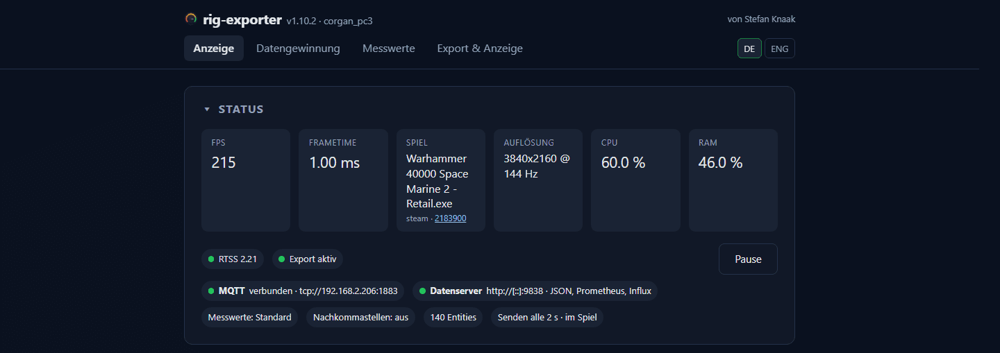

[English](README.md)

# rig-exporter

Telemetrie eines Gaming-PCs für Home Assistant, Prometheus und InfluxDB.

Gelesen werden Bilder pro Sekunde, Frametime und das laufende Spiel aus dem
RivaTuner Statistics Server, dazu Grafikkarte, Prozessor, Laufwerke, Netzwerk,
Latenz und, wo einer da ist, der Akku. Das Programm liegt im Infobereich und
wird über eine Weboberfläche eingestellt, die nur auf `127.0.0.1` lauscht — auf
Deutsch oder Englisch. **Windows 10 und 11, 64 Bit**: die Schnittstellen, aus
denen diese Werte kommen, gibt es nirgendwo sonst.

## Warum dieses Programm

* **Bilder pro Sekunde, Frametime und das laufende Spiel.** Darum geht es. Ein
  allgemeiner Hardware-Monitor meldet diese Werte gar nicht, und sie sind der
  Teil, der sagt, was ein Spielerechner gerade tut.
* **Deutlich weniger Entitäten in Home Assistant.** Jeder der 123 Messwerte
  wird einzeln angehakt, drei Voreinstellungen sind der Ausgangspunkt. Es kommt
  an, was Sie ausgewählt haben, und nicht alles, was die Maschine sagen kann.
* **Eine einzige ausführbare Datei.** Ein Go-Binary von rund 18 MB. Kein
  Installationsprogramm, keine Laufzeitumgebung, keine Abhängigkeiten; zurück
  bleiben eine Konfigurationsdatei und ein Protokoll.
* **Keine Administratorrechte.** Einzige Ausnahme ist PawnIO, ein optionaler
  Kerneltreiber für Temperatur und Leistung von AMD-Prozessoren, der aus
  bleibt, bis ihn jemand einschaltet.
* **Gelesen wird, was ohnehin auf dem Rechner liegt:** RTSS, MSI Afterburner,
  NVML, ADLX und die Leistungsindikatoren von Windows. Einen eigenen Treiber
  bringt das Programm nicht mit.
* **Grafikkarten von AMD und NVIDIA, Prozessoren von Intel und AMD.**
* **Aktualisierung auf Klick.** Signiert: geprüft werden die Signatur der
  veröffentlichten Prüfsummen und danach die Prüfsumme des Archivs, bevor die
  EXE getauscht wird. Die neue Fassung muss ihre Version zurückmelden — bleibt
  sie stumm, kommt die alte zurück.
* **Absturzberichte bleiben auf dem Rechner.** Sie werden auf die Platte
  geschrieben, Benutzerpfade, Passwörter und Tokens ersetzt, und verschickt
  wird nichts, bevor jemand den Knopf zum GitHub-Formular drückt.
* **Quelloffen.** Lesen, mit einem PowerShell-Skript selbst bauen oder das
  signierte Binary aus den Releases nehmen.

**Kein Ersatz für Libre Hardware Monitor oder System Bridge.** Beides sind gute
Programme mit einem anderen Zweck: Sie beschreiben einen Rechner vollständig und
geben jeden Sensor weiter, den sie finden. rig-exporter beschreibt einen
Spielerechner — Bilder pro Sekunde und das laufende Spiel, dazu den Teil der
Hardware, den Sie angehakt haben. Daher deutlich weniger Entitäten in Home
Assistant: nicht weil weniger gemessen würde, sondern weil die Auswahl bei Ihnen
liegt.

## Installation und erster Start

1. `rig-exporter.exe` aus dem
   [aktuellen Release](https://github.com/corgan2222/rig-exporter/releases/latest)
   laden und starten. Installiert wird nichts: im Infobereich erscheint ein
   Symbol, die Oberfläche öffnet sich unter `http://127.0.0.1:8787`.
2. Unter **Export & Anzeige → MQTT** den Broker eintragen. Wenige Sekunden
   später steht das Gerät in Home Assistant.
3. Unter **Messwerte** einen Umfang wählen und abwählen, was nicht gebraucht
   wird.

Konfiguration und Protokoll liegen in `%APPDATA%\rig-exporter`. Für die Bilder
pro Sekunde muss der
[RivaTuner Statistics Server](https://www.guru3d.com/download/rtss-rivatuner-statistics-server-download/)
laufen; alles andere geht ohne ihn.

## Was exportiert wird

| Ziel | Was dort ankommt |
|---|---|
| **Home Assistant** | Die MQTT-Discovery legt die Entitäten selbst an, mit Gerät, Symbol und Einheit. In der `configuration.yaml` ist nichts einzutragen. |
| **MQTT** | Derselbe Zustand als ein JSON auf einem eigenen Topic, für alles auf dem Broker, das nicht Home Assistant ist. |
| **JSON** | `/api/state` des eingebauten HTTP-Servers, auf Wunsch hinter einem Token. |
| **Prometheus** | `/metrics` als Textformat zum Abholen, eine Zeile je Zeitreihe. |
| **InfluxDB** | Line Protocol für 1.8 und 2, abrufbar unter `/influx` oder vom Exporter selbst geschrieben. |

Alles gleichzeitig, wenn man will. Ein Messwert sieht überall gleich aus —
woher er kam, erreicht keinen Export.

## Weiterlesen

* **[Handbuch](https://corgan2222.github.io/rig-exporter/de/)** — der
  Messwertkatalog, die vier Seiten der Oberfläche, die Exportziele, die Diagnose
* **[Releases](https://github.com/corgan2222/rig-exporter/releases)** — das
  Binary und was sich geändert hat
* **[Mitmachen](CONTRIBUTING.md)** — Aufbau, Prüflauf, Regeln für Pull Requests
* **[Lizenz](LICENSE)**
* **[Drittanbieter-Hinweise](THIRD-PARTY-NOTICES.md)** — die Lizenzen der
  Bibliotheken, die mit ins Binary gelinkt werden
