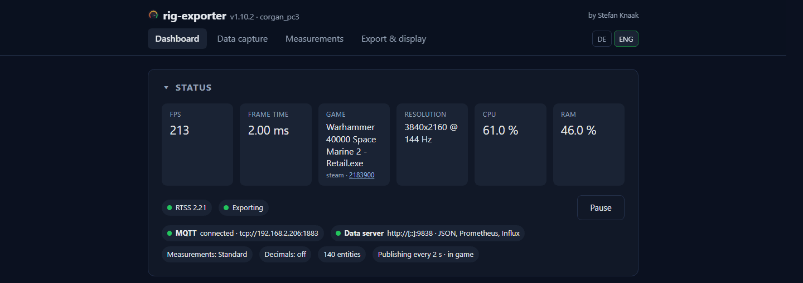

[Deutsch](README.de.md)

# rig-exporter

Telemetry of a gaming PC for Home Assistant, Prometheus and InfluxDB.

It reads frames per second, frame time and the running game from the RivaTuner
Statistics Server, and alongside them the graphics card, processor, drives,
network, latency and, where there is one, the battery. It sits in the tray and
is set up in a web interface that listens on `127.0.0.1` only, in English or
German. **Windows 10 and 11, 64 bit** — the interfaces these values come from
exist nowhere else.

## Why this one

* **Frames per second, frame time and the running game.** This is the point of
  the program. A general-purpose hardware monitor does not report them at all,
  and they are the part that says what a gaming PC is actually doing.
* **Far fewer entities in Home Assistant.** Each of the 123 measurements is
  ticked on its own, with three presets as a starting point. What arrives is
  what you chose, not everything the machine can say.
* **One executable.** A single Go binary, around 18 MB. No installer, no
  runtime, no dependencies; it leaves behind a configuration file and a log.
* **No administrator rights.** The one exception is PawnIO, an optional kernel
  driver for AMD processor temperature and power, off until it is switched on.
* **It reads what is already on the machine:** RTSS, MSI Afterburner, NVML,
  ADLX and the Windows performance counters. It brings no driver of its own.
* **AMD and NVIDIA graphics, Intel and AMD processors.**
* **Updates on a click.** Signed: the signature of the published checksums and
  then the checksum of the archive are verified before the EXE is swapped. The
  new build has to report its version back — if it stays silent, the old one is
  fetched back.
* **Crash reports stay on the machine.** They are written to disk with user
  paths, passwords and tokens replaced, and nothing is sent until you press the
  button that opens the GitHub form.
* **Open source.** Read it, build it yourself with one PowerShell script, or
  take the signed binary from the releases page.

**Not a replacement for Libre Hardware Monitor or System Bridge.** Both are good
programs with a different purpose: they describe a computer completely and hand
over every sensor they find. rig-exporter describes a gaming computer — frames
per second and the running game, plus the part of the hardware you ticked.
Hence far fewer entities in Home Assistant: not because less is measured, but
because the selection is yours.

## Install and first run

1. Download `rig-exporter.exe` from the
   [latest release](https://github.com/corgan2222/rig-exporter/releases/latest)
   and start it. Nothing is installed: an icon appears in the tray and the
   interface opens at `http://127.0.0.1:8787`.
2. Under **Export & display → MQTT**, enter the broker. Home Assistant shows
   the device a few seconds later.
3. Under **Measurements**, pick a preset and untick what you do not need.

Configuration and log live in `%APPDATA%\rig-exporter`. Frames per second need
the [RivaTuner Statistics Server](https://www.guru3d.com/download/rtss-rivatuner-statistics-server-download/)
running; everything else works without it.

## What it exports

| Target | What arrives there |
|---|---|
| **Home Assistant** | MQTT discovery creates the entities itself, with device, icon and unit. Nothing to enter in `configuration.yaml`. |
| **MQTT** | The same state as one JSON object on a topic of its own, for everything on the broker that is not Home Assistant. |
| **JSON** | `/api/state` on the built-in HTTP server, optionally behind a token. |
| **Prometheus** | `/metrics` as a text exposition, one line per time series, to be scraped. |
| **InfluxDB** | Line protocol for 1.8 and 2, fetched from `/influx` or written out by the exporter itself. |

All of them at once, if you want. A value looks the same in every one of them —
which source it came from reaches no export.

## Where to go next

* **[Handbook](https://corgan2222.github.io/rig-exporter/)** — the measurement
  catalogue, the four interface pages, the export targets, diagnostics
* **[Releases](https://github.com/corgan2222/rig-exporter/releases)** — the
  binary and what changed
* **[Contributing](CONTRIBUTING.md)** — layout, check run, rules for pull
  requests
* **[Licence](LICENSE)**
* **[Third-party notices](THIRD-PARTY-NOTICES.md)** — the licences of the
  dependencies linked into the binary
