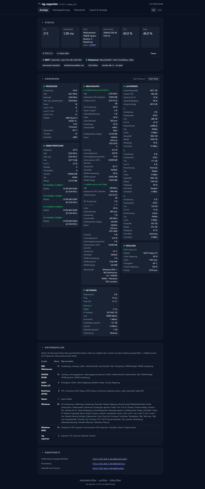

# Anzeige

Live-Werte, Zustand der Exportziele, ein Panel je Sensorgruppe und die Adressen
der aktiven Endpunkte. Aktualisiert sich im Auslese-Intervall. Die einzige Seite
ohne Einstellungen — bis auf zwei Schalter, die hier stehen, weil man hier
merkt, dass man sie braucht.

Unter den Kacheln sagen vier Chips, was gerade eingestellt ist: welcher Umfang,
ob mit Nachkommastellen, wie viele Entities entstehen, und in welchem Takt
gesendet wird — dabei der Takt, der **gerade** gilt, mit dem Zusatz „im Spiel"
oder „Leerlauf". Eine Zahl ohne diesen Zusatz wäre wertlos, weil es zwei davon
gibt. Jeder Chip führt auf die Einstellung, die ihn bestimmt; einen Wert zu
lesen und ihn zu ändern soll nicht zwei Suchen sein. Kacheln für Werte, die der
gewählte Umfang gar nicht misst, werden ausgeblendet statt leer angezeigt.

Die Kachel **Spiel** zeigt die ausführbare Datei, also das, was der gleichnamige
Messwert veröffentlicht. Ist
[das Spiel ermitteln](data-capture.md#das-spiel-ermitteln) eingeschaltet, stehen
Plattform und Steam-AppID klein darunter — und nur dann, wenn sie tatsächlich
bekannt sind, denn eine leere zweite Zeile läse sich wie ein fehlgeschlagener
Messwert.

Die Kachel **FPS** ist nach dem Band eingefärbt, in das die Rate fällt, damit
ein Blick reicht:

| Bilder pro Sekunde | Farbe |
|---|---|
| unter 30 | dunkles Orange |
| 30 bis 55 | Orange |
| über 55 | Grün |

Eine Rate, die sich nicht messen ließ, bleibt ungefärbt — an einem Strich ist
nichts zu beurteilen.

**CPU** und **RAM** sind andersherum eingefärbt, denn bei einer Auslastung ist
das obere Ende das schlechte — und beide nach derselben Skala: sie stehen
nebeneinander, und zwei Prozentwerte, die an verschiedenen Marken die Farbe
wechseln, laden dazu ein, die Farben statt der Zahlen zu vergleichen.

| Auslastung | Farbe |
|---|---|
| bis 50 % | keine |
| über 50 % | Orange |
| über 80 % | Rot |

Grün wird hier unten nichts. Ein ruhiger Prozessor ist der Normalfall, und eine
Farbe, die fast immer an ist, sagt nichts mehr, wenn es darauf ankommt.

Die Farbe steht nur auf dem Bildschirm; in einen Export gelangt davon nichts,
dort ist die Zahl die Zahl.

In den Hardware-Panels lässt sich zwischen zwei Ansichten umschalten.
Voreingestellt ist **nach Gerät**: alles zu GPU 0 zusammen, dann alles zu GPU 1,
jede Platte für sich, jeder Adapter für sich — jede Gruppe unter einer
Überschrift mit dem Gerätenamen, die Werte darunter nur kurz benannt. **Nach
Messwert** lässt diese Überschriften weg und schreibt das Gerät stattdessen in
jede einzelne Zeile. Die Reihenfolge ist in beiden Fällen dieselbe, Gerät für
Gerät; es ändert sich nur, wo der Gerätename steht. Die Wahl bleibt im Browser
gespeichert.

Eine Zeile, deren Messwert ausbleibt, bleibt **zwanzig Auslesevorgänge lang
stehen**, bevor sie verschwindet. Manche Werte kommen nicht bei jedem Durchgang —
ein Windows-Zähler für eine Grafik-Engine existiert nur, solange etwas diese
Engine benutzt — und ein Panel, das die Zeile beim ersten Fehlen fallen lässt,
ändert alle paar Sekunden seine Höhe und verschiebt die Seite unter dem Leser.
Eine gehaltene Zeile zeigt den zuletzt tatsächlich gemessenen Wert, ausgegraut
und kursiv, mit dem Grund im Tooltip.

Zwanzig Auslesevorgänge und keine feste Sekundenzahl: wer das
[Auslese-Intervall](../polling-and-publishing.md) verlangsamt, verlängert die
Wartezeit mit, eine Zeile bleibt also unabhängig vom Takt gleich viele Messungen
lang stehen. Wird eine Sensorgruppe abgeschaltet oder fällt eine Quelle aus,
leert sich ihr Panel sofort — das ist eine Anweisung beziehungsweise ein Fehler,
kein ausgebliebener Messwert.

Das gilt nur für die Anzeige. Was eine gehaltene Zeile zeigt, erreicht weder
MQTT noch JSON, Prometheus oder InfluxDB: ein nicht gemessener Wert
[wird im Export weggelassen](../export-targets.md) und nie als veralteter Wert
oder als Null gesendet.

Fehlt auf einem Rechner die GPU beziehungsweise werden dort bewusst keine
Spieldaten genutzt, lässt sich der RTSS-Hinweis dauerhaft wegräumen. Der Knopf
heißt **„Keine GPU vorhanden — Spieldaten ausblenden"**, wenn Windows gar keine
Grafikkarte meldet, und **„Kein Spielrechner — Spieldaten ausblenden"**, wenn
eine da ist: derselbe Schalter, aber einer Radeon zu erklären, sie sei nicht
vorhanden, wäre schlicht falsch. Die Einstellung wird als `no_gpu` in
`config.json` gespeichert und blendet zusätzlich die Kacheln FPS, Frametime und
Spiel sowie den RTSS-Statuschip aus. Unter
[*Export & Anzeige → Anwendung*](export-and-display.md#anwendung) lässt sie sich
wieder abschalten. Messung und Exporte ändern sich dadurch nicht.

