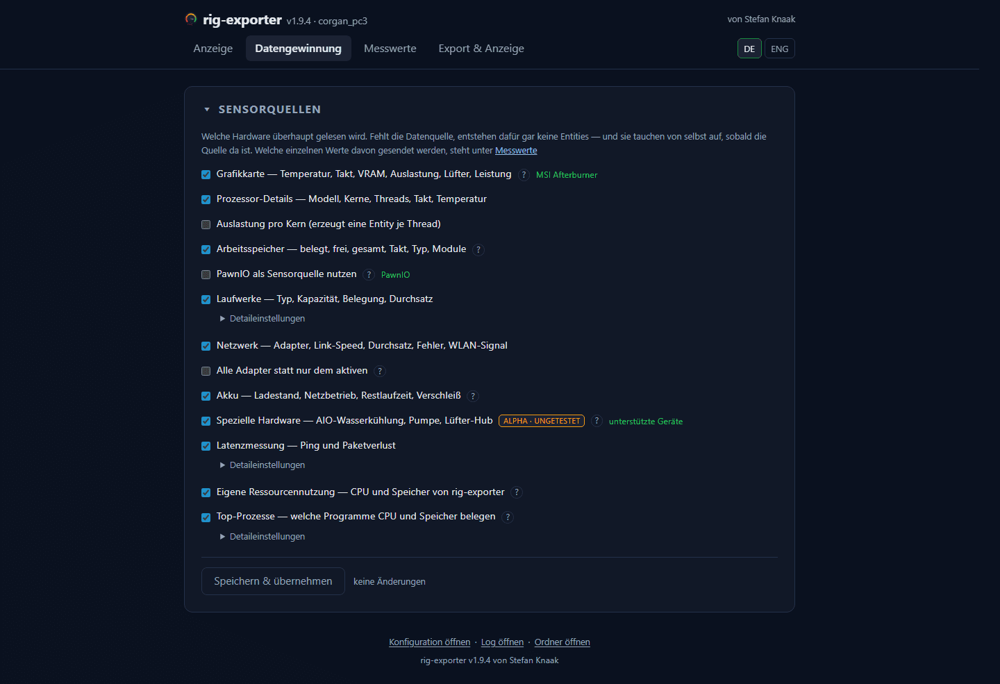

# Datengewinnung

Welche Hardware überhaupt gelesen wird. Fehlt die Datenquelle, entstehen dafür
gar keine Entities — und sie tauchen von selbst auf, sobald die Quelle da ist.

| Option | Vorgabe | Was sie bewirkt |
|---|---|---|
| **Grafikkarte** — Temperatur, Takt, VRAM, Auslastung, Lüfter, Leistung | an | Die ganze GPU-Gruppe. Ohne Live-Quelle bleibt das DXGI-Inventar |
| **Prozessor-Details** — Modell, Kerne, Threads, Takt, Temperatur | an | Die statischen CPU-Angaben zusätzlich zur reinen Auslastung |
| ↳ **Auslastung pro Kern** | **aus** | Eine Entity **je Thread**. Bei 16 Kernen sind das 32 — deshalb aus |
| **Arbeitsspeicher** — belegt, frei, gesamt, Takt, Typ, Module | an | Auch die Bestückung der Steckplätze |
| **PawnIO als Sensorquelle nutzen** | **aus** | CPU-Leistung und -Temperatur über den Kerneltreiber. Wirkt nur, solange **Prozessor-Details** an ist, und verlangt Administratorrechte — siehe [PawnIO](../requirements.md#pawnio) |
| **Laufwerke** — Typ, Kapazität, Belegung, Durchsatz | an | Alle festen Laufwerke |
| ↳ **Nur diese Laufwerke** | leer | Laufwerksbuchstaben, kommagetrennt, z. B. `C, D`. Leer = alle |
| **Netzwerk** — Adapter, Link-Speed, Durchsatz, Fehler, WLAN-Signal | an | Nur der **aktive** Adapter |
| ↳ **Alle Adapter statt nur dem aktiven** | aus | Auch VPN-, Hyper-V- und Bluetooth-Adapter — meist mehr Rauschen als Nutzen |
| **Akku** — Ladestand, Netzbetrieb, Restlaufzeit, Verschleiß | an | Auf einem Desktop ohne Akku entsteht nichts |
| **Spezielle Hardware** — AIO-Wasserkühlung, Pumpe, Lüfter-Hub | **aus** | Als `ALPHA · ungetestet` gekennzeichnet: nachgebaute Protokolle gegen Geräte, die hier größtenteils niemand besitzt |
| **Latenzmessung** — Ping und Paketverlust | an | Ziel leer = Standard-Gateway; sonst Hostname oder IPv4. Misst nur, solange **Netzwerk** an ist |
| ↳ **Echos pro Runde** / **Messintervall** | 3 / 15000 ms | Getrennt vom Auslese-Intervall, weil ein Ping länger dauert als ein Zählerabruf |
| **Eigene Ressourcennutzung** — CPU und Speicher von rig-exporter | **aus** | Was das Programm die Maschine kostet, die es misst |
| **Top-Prozesse** — welche Programme CPU und Speicher belegen | **aus** | Braucht einen Durchlauf über alle Prozesse |
| ↳ **Wie viele je Liste** / **Messintervall** | 5 / 10000 ms | Zehn Sekunden reichen, um zu sehen, was ein Spiel oder ein Build getan hat |
| **Versuche Gamename und SteamID zu ermitteln** (Steam, Epic, GOG) | **aus** | Als `ALPHA · Internet` gekennzeichnet: die einzige Option, die einen Dritten kontaktiert. Siehe unten |

Das ↳ heißt: die Zeile wirkt nur, solange die Gruppe darüber an ist. In der
Oberfläche stehen **Auslastung pro Kern** und **Alle Adapter statt nur dem
aktiven** als gewöhnliche Kästchen direkt unter ihrer Gruppe; **Nur diese
Laufwerke**, das Ping-Ziel samt Echos und Messintervall und die beiden Werte der
Top-Prozesse liegen hinter einem zugeklappten **Detaileinstellungen**.
Aufklappen geht jederzeit — auch wenn die Gruppe darüber aus ist und die Werte
darin nichts bewirken.

## Das Spiel ermitteln

RTSS meldet die ausführbare Datei — `Cyberpunk2077.exe` — und genau das
veröffentlicht der Messwert **Spiel** seit jeher. Diese Option ergänzt, wie die
Launcher und der Steam-Store diese Datei nennen: die Plattform, den Titel in der
Schreibweise des Stores und die Steam-AppID, die das Titelbild adressiert.

Drei Quellen, die billigste zuerst — die Registry von Steam, dann die Kataloge
von GOG und Epic auf der Platte, dann die öffentliche Steam-Suche, die als
einzige den Rechner verlässt — und diese Option damit zur einzigen Einstellung
des Programms macht, die mit dem Server eines Dritten spricht. An der Entity
**Spiel** ändert das
nichts: ihr Zustand bleibt die ausführbare Datei, ihre Entity-ID bleibt
dieselbe, und Plattform, Titel und AppID kommen als **Attribute** derselben
Entity dazu — siehe [Exportziele](../export-targets.md#spiel-attribute).

Standardmäßig aus und als `ALPHA · Internet` gekennzeichnet. Was genau gesendet
wird, wie Erweiterungen daran gehindert werden, das falsche Bild zu erzeugen,
und was ein Dashboard damit anfängt: [Spielerkennung](../game-identification.md).

