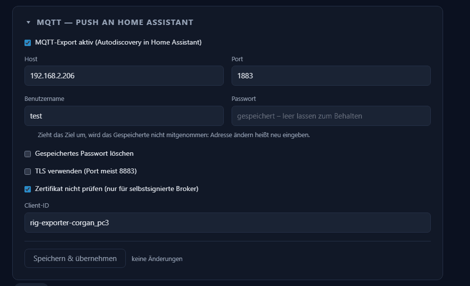
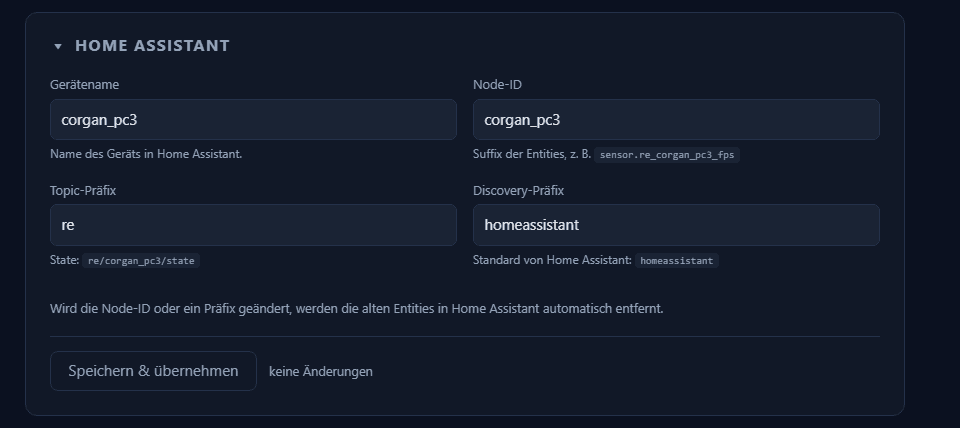
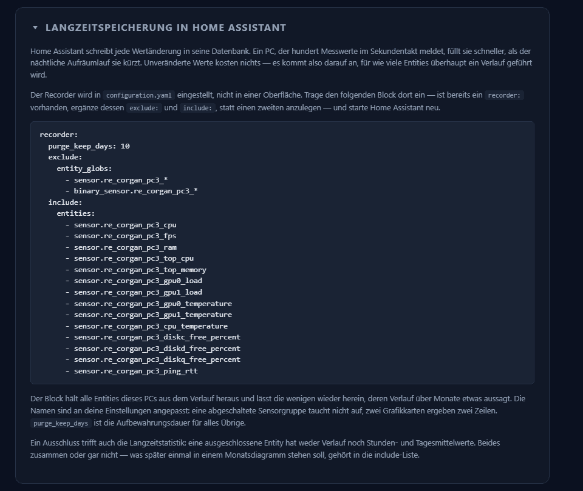
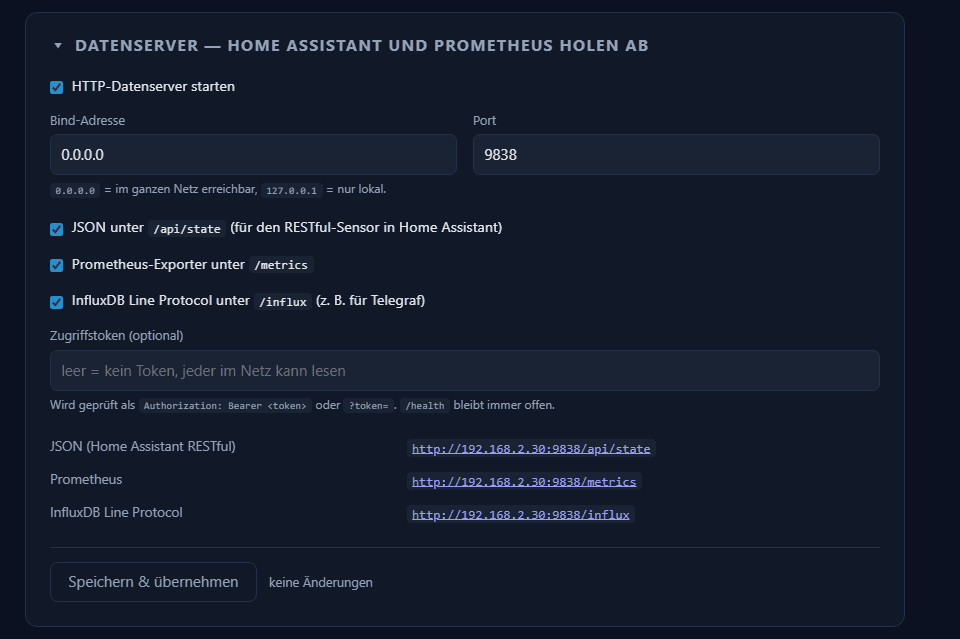
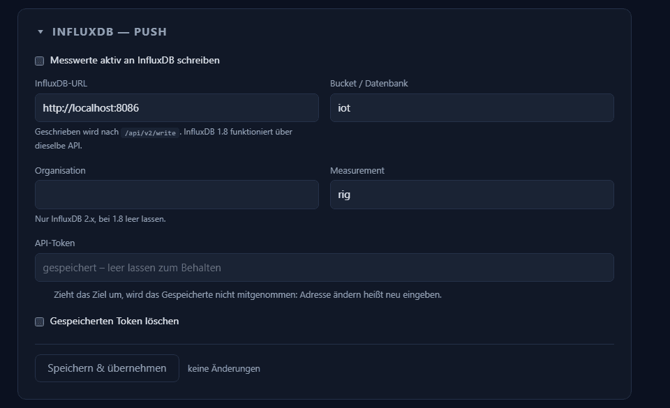

# Export & Anzeige

Wohin die Werte gehen, und wie sich das Programm selbst verhält. Sieben Kästen,
von oben nach unten: **MQTT**, **Home Assistant**, **Langzeitspeicherung**,
**Datenserver**, **InfluxDB**, **Anwendung** und ganz unten **Protokolle**. Fünf
davon haben einen eigenen Speichern-Button, der jeweils nur diesen einen Kasten
speichert — siehe [Was für alle Seiten gilt](common.md).

Hier stehen die Felder. Was damit tatsächlich hinausgeht und wie ein Empfänger
es liest, steht unter [Exportziele](../export-targets.md).

## Was für alle Kästen gilt

**Der Verbindungszustand** steht unter den aktiven Push-Zielen, also unter MQTT
und InfluxDB: beim Aufbau gelb, im Betrieb grün, bei einem Fehler rot mit der
letzten Meldung im Wortlaut und einem Knopf, der das Log öffnet. Solange es
läuft, nennt die Zeile das Ziel — bei MQTT die Broker-Adresse, bei InfluxDB URL
und Bucket — und dahinter die Zahl dessen, was bisher gesendet wurde. Sie
aktualisiert sich alle drei Sekunden, ohne dass die Seite neu geladen wird. Push
ist der Weg, der aktiv hinausschreibt und damit scheitern kann, ohne dass ein
Abruf den Fehler sichtbar macht; das Log zu suchen soll dann keine eigene Übung
sein.

**Geheimnisse werden nie angezeigt.** Ein gespeichertes Passwort oder Token
steht als *gespeichert – leer lassen zum Behalten* da, und wo eines gespeichert
ist, steht darunter ein Kästchen zum Löschen. Ändert sich die **Broker-Adresse**
oder die **InfluxDB-URL**, ohne dass das Passwort beziehungsweise das Token in
derselben Eingabe mitkommt, wird es fallen gelassen statt an die neue Adresse
geschickt — nach genau diesen beiden Adresswechseln muss man es also neu
eingeben. Das Zugriffstoken des Datenservers ist davon nicht betroffen: es wird
hier geprüft und nirgendwohin geschickt.

**Zwei Kästen haben keinen Speichern-Button.** Die Langzeitspeicherung ändert an
diesem Programm nichts, sondern rechnet vor; die Protokolle zeigen nur an.

## MQTT — Push an Home Assistant

Standardmäßig **an**. Der Weg, für den dieses Programm gebaut ist: das Gerät
und alle Entities entstehen in Home Assistant von selbst.

| Feld | Vorgabe | Bedeutung |
|---|---|---|
| Host | `homeassistant.local` | Der **Broker**, nicht Home Assistant. Meist dieselbe Maschine, aber nicht dasselbe Programm |
| Port | `1883` | Mit TLS üblicherweise 8883 |
| Benutzername / Passwort | leer | Wie im Broker angelegt. Das Passwort wird nie wieder angezeigt |
| TLS verwenden | aus | |
| Zertifikat nicht prüfen | aus | Nur für selbstsignierte Broker. Schaltet die Prüfung ab, nicht die Verschlüsselung |
| Client-ID | `rig-exporter-<node>` | Muss auf dem Broker eindeutig sein — zwei Verbindungen mit derselben ID werfen sich gegenseitig hinaus |

!!! warning "Discovery muss in Home Assistant eingeschaltet sein"

    Ohne sie kommen die Nachrichten an und **es passiert nichts**: Home
    Assistant legt keine Entities an, und weder hier noch dort erscheint eine
    Fehlermeldung. In der
    [MQTT-Integration](https://www.home-assistant.io/integrations/mqtt/#mqtt-discovery)
    ist *Discovery* ab Werk aktiv und das Präfix `homeassistant` — passt also,
    solange niemand es geändert hat. Wurde es geändert, muss das
    Discovery-Präfix im nächsten Abschnitt genau dazu passen.

    Und Home Assistant braucht die
    [MQTT-Integration](https://www.home-assistant.io/integrations/mqtt/)
    überhaupt erst eingerichtet. Ein laufender Broker allein genügt nicht.

Was damit auf dem Broker ankommt — Topics, Entity-IDs, Discovery-Verhalten —
steht unter [Exportziele → MQTT](../export-targets.md#mqtt).

## Home Assistant

Wie das Gerät dort heißt und unter welchen Kennungen die Werte ankommen.

| Feld | Vorgabe | Wirkung einer Änderung |
|---|---|---|
| Gerätename | Rechnername | Nur der angezeigte Name des Geräts |
| Node-ID | Rechnername, kleingeschrieben | **Steckt in jeder Entity-ID.** Ändern benennt alle Entities um |
| Topic-Präfix | `rig-exporter` | Wohin die Zustände geschrieben werden |
| Discovery-Präfix | `homeassistant` | Muss dem entsprechen, was die MQTT-Integration erwartet |

Wird eine dieser Angaben geändert, räumt das Programm die alten Entities beim
nächsten Verbinden selbst vom Broker ab. Dashboards und Automatisierungen, die
auf den alten Namen zeigen, muss man dann umhängen — siehe
[Bezeichner und Einordnung](../identifiers.md).

## Langzeitspeicherung in Home Assistant

Der dritte Kasten von oben; die Sprungleiste über der Seite nennt ihn kurz
*Speicherung*. Er ändert an diesem Programm nichts — er rechnet vor und gibt
einen fertigen Konfigurationsblock aus, deshalb hat er keinen Speichern-Button.

**Warum es den gibt.** Home Assistant schreibt jede Zustandsänderung in seine
Datenbank. Bei einem Sendeintervall von zwei Sekunden und gut hundert Entities
sind das Zehntausende Zeilen am Tag — von *einem* Rechner. Die Datenbank wächst
dadurch schnell, Neustarts dauern länger, und das Anlegen der Historie kostet
spürbar Leistung. Nichts davon fällt sofort auf; es fällt nach Wochen auf.

Der Kasten gibt deshalb einen
[`recorder:`](https://www.home-assistant.io/integrations/recorder/)-Block aus,
der genau die Entities dieses Rechners benennt. Drei Möglichkeiten damit:

* **Alles behalten** — nichts eintragen. Nur sinnvoll bei langem
  Sendeintervall.
* **Den ausgegebenen Block eintragen.** Er schließt *alle* Entities dieses
  Rechners per Glob aus und lässt zehn Messwerte wieder herein, deren Verlauf
  über Monate etwas aussagt: FPS, CPU- und GPU-Auslastung, CPU- und
  GPU-Temperatur, RAM-Belegung, freier Platz je Laufwerk, Ping und die beiden
  Top-Prozess-Listen. Draußen bleiben also Taktraten, Lüfterdrehzahlen,
  Durchsatz und die Bestandsangaben. Die Werte bleiben in Home Assistant
  sichtbar, sie werden nur nicht aufbewahrt.
* **Kürzer aufheben** — `purge_keep_days` herabsetzen.

Der Block ist an die eigenen Einstellungen angepasst: eine abgeschaltete
Sensorgruppe taucht nicht auf, zwei Grafikkarten ergeben zwei Zeilen.

!!! warning "Ein Ausschluss trifft auch die Langzeitstatistik"

    Eine ausgeschlossene Entity hat weder Verlauf noch Stunden- und
    Tagesmittelwerte. Beides zusammen oder gar nicht — was später einmal in
    einem Monatsdiagramm stehen soll, gehört in die `include`-Liste.

Wer die Werte langfristig als Diagramm braucht, ist mit
[Prometheus](../export-targets.md#prometheus) besser bedient.

## Datenserver — Home Assistant und Prometheus holen ab

Standardmäßig **aus**. Kein Push, sondern ein Webserver: der Empfänger holt
sich die Werte, wann er will.

| Feld | Vorgabe | Bedeutung |
|---|---|---|
| Bind-Adresse | `0.0.0.0` | Im ganzen Netz erreichbar. `127.0.0.1` = nur dieser Rechner |
| Port | `9838` | |
| Zugriffstoken | leer | Leer heißt: **jeder im Netz darf lesen** |

Darunter drei Kästchen, eines je Datenformat — JSON, Prometheus und Line
Protocol lassen sich einzeln an- und abschalten. `/health` und die
Übersichtsseite `/` sind immer da.

Welcher Pfad was liefert und wer ihn abholt, steht unter
[Exportziele → HTTP-Datenserver](../export-targets.md#http-datenserver).

## InfluxDB — Push

Standardmäßig **aus**. Das Gegenstück zu `/influx`: hier schreibt das Programm
von selbst, statt abgeholt zu werden. Beide Wege gleichzeitig ergeben doppelte
Daten.

Geschrieben wird immer nach `/api/v2/write`. InfluxDB 1.8 bedient dieselbe
API — die Felder werden nur anders belegt:

| Feld | InfluxDB 2.x | InfluxDB 1.8 |
|---|---|---|
| InfluxDB-URL | `http://host:8086` | dieselbe |
| Bucket / Datenbank | Name des **Buckets** | Name der **Datenbank** |
| Organisation | Name der Organisation | **leer lassen** |
| Measurement | `rig` | `rig` |
| API-Token | Token mit Schreibrecht auf das Bucket | `benutzer:passwort` — beides in *ein* Feld, mit Doppelpunkt |

Wer bei 1.8 die Organisation ausfüllt, bekommt eine Fehlermeldung, die nach
einem Rechteproblem aussieht und keines ist.

Wie die Punkte aussehen, die dabei geschrieben werden — Measurements, Tags und
Felder —, steht unter [Exportziele → InfluxDB](../export-targets.md#influxdb).

## Anwendung

Wie sich das Programm selbst verhält, unabhängig von jedem Exportziel.

| Einstellung | Vorgabe | Bemerkung |
|---|---|---|
| Sprache | folgt Windows | Wirkt auf Oberfläche, Tray und die *angezeigten* Namen in Home Assistant, nicht auf die Kennungen |
| Port dieser Seite | `8787` | Wirkt erst nach einem Neustart. Ist der Port belegt, weicht der Server auf einen zufälligen aus |
| Diese Seite im Netzwerk erreichbar machen | aus | Öffnet die Oberfläche fürs LAN — **ohne Anmeldung**. Was das heißt, steht unter [Oberfläche im Netzwerk](on-the-network.md) |
| Mit Windows starten | aus | Startet mit `-background`, also ohne Browserfenster |
| Debug-Logging | aus | Wirkt erst nach einem Neustart |
| Auf neue Versionen prüfen | an | Aus verlässt keine Anfrage den Rechner |
| Keine GPU / keine Spieldaten | aus | Blendet FPS, Frametime, Spiel und den RTSS-Hinweis aus. Messung und Export ändern sich nicht |

## Protokolle

Der letzte Kasten der Seite zeigt das laufende Protokoll direkt im Browser,
darunter die aufgehobenen Dateien samt Absturzberichten — jede zum Ansehen und
zum Herunterladen, und ein Knopf löscht die aufgehobenen wieder. Nichts davon
verlässt diesen Rechner.

Was in den Zeilen steht und wie man sie liest, steht unter
[Protokolle im Browser](../diagnostics.md#protokolle-im-browser).
