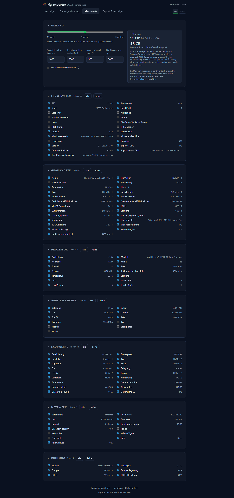
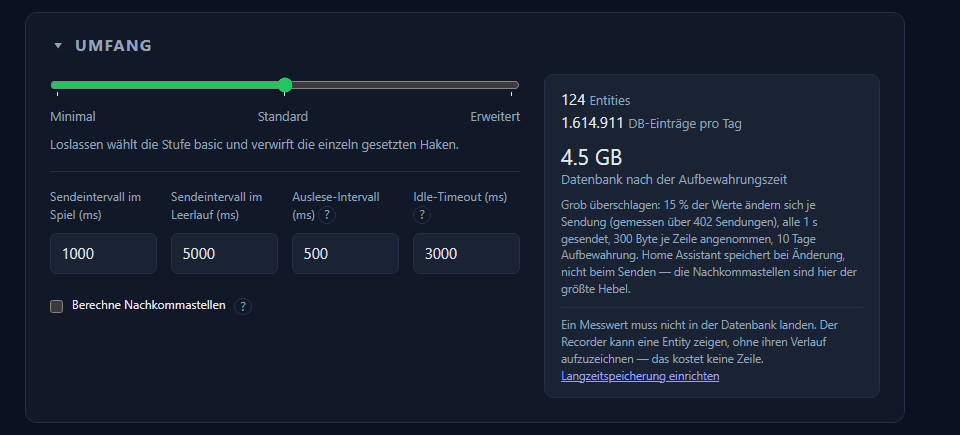

# Messwerte

Hier steht, welche der gelesenen Werte tatsächlich gesendet werden, und wie oft.

**Umfang** — drei Voreinstellungen als Ausgangspunkt:

| Umfang | Gedacht für |
|---|---|
| **Minimal** | Nur das, was auf einer Kachel steht |
| **Standard** | Der übliche Satz |
| **Erweitert** | Alles, was die Maschine hergibt — die Vorgabe |

Die Vorgabe ist bewusst der größte Satz: wer weniger will, kann das sagen, aber
ein Wert, der nie angeboten wurde, ist ein Wert, nach dem niemand fragt.
Darunter steht **jeder einzelne Messwert einzeln abwählbar** — der Umfang setzt
nur den Startpunkt, er sperrt nichts.

Die vier Zeitangaben:

| Einstellung | Vorgabe | Bedeutung |
|---|---|---|
| **Auslese-Intervall** | 500 ms | Wie oft gemessen wird. Tray und Anzeige bleiben dadurch flüssig |
| **Sendeintervall im Spiel** | 2000 ms | Wie oft exportiert wird, solange etwas rendert |
| **Sendeintervall im Leerlauf** | 10000 ms | Dasselbe, wenn nichts rendert — ein untätiger Rechner hat nicht alle zwei Sekunden etwas zu sagen |
| **Idle-Timeout** | 3000 ms | Ab wann „Leerlauf" gilt |

Gemessen wird also viermal so oft wie gesendet. Das ist Absicht: die Anzeige
lebt vom schnellen Takt, der Broker hätte davon nichts.

**Berechne Nachkommastellen** (an) rundet Werte auf sinnvolle Stellen statt sie
in voller Fließkommabreite zu senden.

Rechts neben Umfang und Takten steht die Überschlagsrechnung zur
Datenbankgröße; in einem schmalen Fenster rutscht sie darunter. Beim ersten
Besuch erscheint unter dem Kasten ein Hinweis auf die wachsende
Home-Assistant-Datenbank samt fertigem
[`recorder:`-Abschnitt](export-and-display.md#langzeitspeicherung-in-home-assistant).
„Gelesen, nicht wieder anzeigen" räumt ihn dauerhaft weg — in der Konfiguration
gemerkt, anders als die gewählte Ansicht der Hardware-Panels.

