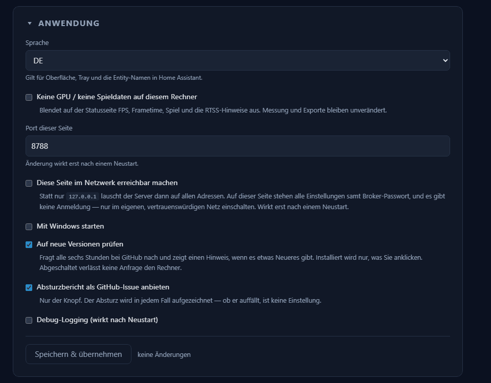

# Oberfläche im Netzwerk

Voreingestellt lauscht die Oberfläche nur auf `127.0.0.1` — erreichbar also von
diesem Rechner und von sonst niemandem. **Diese Seite im Netzwerk erreichbar
machen** unter *Anwendung* bindet stattdessen an `0.0.0.0`, womit sie unter der
LAN-Adresse dieses PCs offensteht. Wirkt nach einem Neustart, wie die
Portänderung darüber.

> **Was das bedeutet:** die Oberfläche hat **keine Anmeldung**. Wer sie
> erreicht, kann jede Einstellung ändern. Die gespeicherten Zugangsdaten sieht
> er nicht — die Seite zeigt sie nie an —, aber er könnte das Ziel umbiegen, an
> das sie geschickt werden. Genau dagegen gilt: **ein Geheimnis reist nicht
> mit.** Ändert sich die Broker-Adresse oder die InfluxDB-URL, ohne dass das
> Passwort beziehungsweise das Token in derselben Eingabe mitkommt, werden sie
> fallen gelassen statt an die neue Adresse geschickt. Das ist der Grund, warum
> nach einem Adresswechsel neu eingegeben werden muss.
>
> Trotzdem: nur in einem Netz einschalten, dem du vertraust, sonst hinter einen
> Reverse Proxy mit Anmeldung — und niemals ins Internet weiterleiten. Im
> Zweifel aus lassen, die Vorgabe ist Loopback und die ist richtig.

Ein zweiter Riegel liegt davor, und der greift auch auf reinem Loopback: ein
Formular-Absenden ist ein CORS-Simple-Request und braucht keine Erlaubnis, eine
besuchte Webseite könnte hier also einfach etwas abschicken. Deshalb nimmt die
Oberfläche eine ändernde Anfrage nur an, wenn der Browser sie als von dieser
Seite kommend ausweist; alles andere bekommt eine 403. Lesen ist davon nicht
betroffen, ein Lesezeichen funktioniert also weiter.

Zwei Dinge folgen automatisch mit: der oberste Tray-Eintrag und der
„Visit"-Link auf der Home-Assistant-Geräteseite zeigen dann auf die LAN-Adresse
statt auf `127.0.0.1`. Der Link funktioniert damit auch vom Handy aus. Die
Adresse wird über die Default-Route ermittelt und nicht aus dem Rechnernamen
gebaut, weil eine Adresse auch dort funktioniert, wo die Namensauflösung im
lokalen Netz es nicht tut.

Der Datenserver weiter oben auf derselben Seite ist davon unabhängig: der
lauscht seit jeher auf `0.0.0.0`, kennt aber ein Token.
