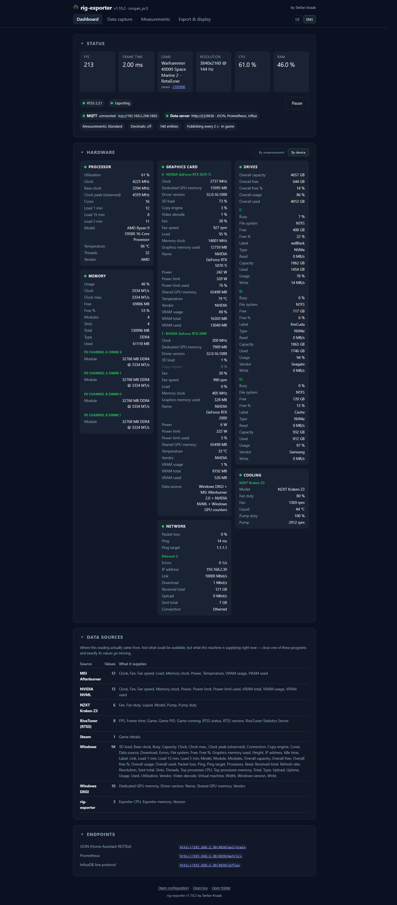

# Dashboard

Live readings, the state of the export targets, one panel per sensor group and
the addresses of the active endpoints. Refreshes at the read interval. The only
page without settings — apart from two switches that sit here because this is
where you notice you need them.

Under the tiles, four chips say what is set right now: which scope, whether
decimals are on, how many entities are created, and how often it publishes —
and that is the rate in force **right now**, with "in game" or "idle" added. A
number without that addition would be worthless, because there are
two of them. Every chip leads to the setting that determines it; reading a value
and changing it should not be two searches. Tiles for values the chosen scope
does not measure at all are hidden rather than shown empty.

The **Game** tile shows the executable, which is what the measurement of that
name publishes. With
[working out the game](data-capture.md#working-out-the-game) switched on, the
platform and the Steam app id stand under it in small type — and only when they
are actually known, because an empty second line would read as a reading that
failed.

The **FPS** tile is coloured by the band the rate falls into, so a glance is
enough:

| Frames per second | Colour |
|---|---|
| under 30 | dark orange |
| 30 to 55 | orange |
| over 55 | green |

A rate that could not be measured stays uncoloured — a dash has nothing to
judge. The colour is on screen only; nothing about it reaches an export, where
the number is the number.

The hardware panels can be switched between two views. The default is **By
device**: everything about GPU 0 together, then everything about GPU 1, each
disk on its own, each adapter on its own — every group under a heading carrying
the device name, the values below it named only briefly. **By measurement**
leaves those headings out and writes the device into every single row instead.
The order is the same either way, device by device; only where the device name
sits changes. The choice is kept in the browser.

A row whose reading stops arriving is **held in place for twenty reads** before
it goes. Some readings are not there on every pass — a Windows counter for a
graphics engine only exists while something is using that engine — and a panel
that drops the row the moment one is missing changes height every few seconds
and moves the page under whoever is reading it. A held row shows the last value
that was actually measured, greyed out and in italics, with the reason on hover.

Twenty reads and not a fixed number of seconds: slowing the
[read interval](../polling-and-publishing.md) down stretches the wait with it,
so a row lingers for the same number of readings whatever the rate. Switching a
sensor group off, or a source failing, empties its panel immediately — that is an
instruction or a fault, not a missed reading.

This is display only. What a held row shows never reaches MQTT, JSON, Prometheus
or InfluxDB: a value that was not measured is
[left out of an export](../export-targets.md), never sent as a stale one or as a
zero.

Where a machine has no GPU, or is deliberately not used for game data, the RTSS
notice can be cleared away for good. The button reads **"No GPU present — hide
game status"** when Windows reports no graphics card at all, and **"Not used for
gaming — hide game status"** when there is one: the same switch, but telling a
Radeon that it is not present would simply be wrong. The setting is stored as
`no_gpu` in `config.json` and additionally hides the FPS, Frame time and Game
tiles along with the RTSS status chip. It can be switched off again under
[*Export & display → Application*](export-and-display.md#application). Collection
and exports do not change because of it.
