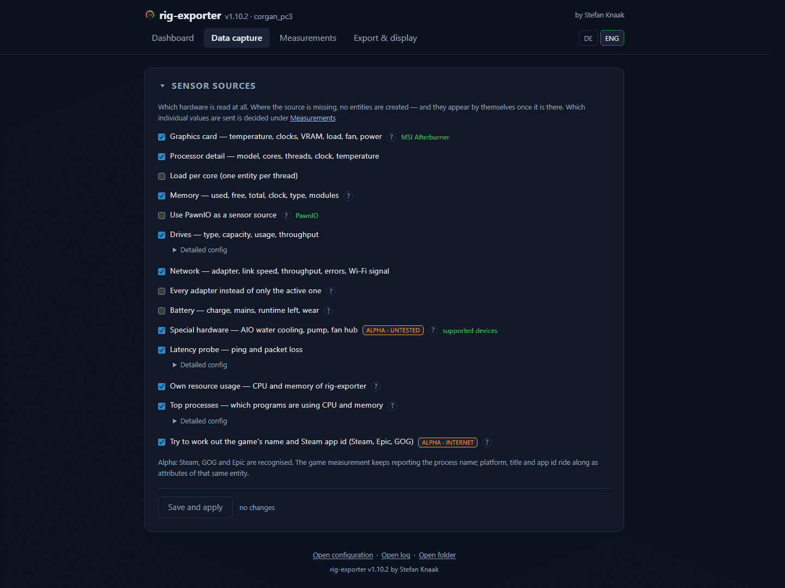

# Data capture

Which hardware is read at all. Where the source is missing, no entities are
created — and they appear by themselves once it is there.

| Option | Default | What it does |
|---|---|---|
| **Graphics card** — temperature, clocks, VRAM, load, fan, power | on | The whole GPU group. Without a live source the DXGI inventory remains |
| **Processor detail** — model, cores, threads, clock, temperature | on | The static CPU facts on top of plain load |
| ↳ **Load per core** | **off** | One entity **per thread**. With 16 cores that is 32 — which is why it is off |
| **Memory** — used, free, total, clock, type, modules | on | The population of the slots as well |
| **Use PawnIO as a sensor source** | **off** | CPU power and temperature through the kernel driver. Only takes effect while **Processor detail** is on, and requires administrator rights — see [PawnIO](../requirements.md#pawnio) |
| **Drives** — type, capacity, usage, throughput | on | Every fixed drive |
| ↳ **Only these drives** | blank | Drive letters, comma separated, e.g. `C, D`. Blank = all |
| **Network** — adapter, link speed, throughput, errors, Wi-Fi signal | on | Only the **active** adapter |
| ↳ **Every adapter instead of only the active one** | off | VPN, Hyper-V and Bluetooth adapters too — usually more noise than use |
| **Battery** — charge, mains, runtime left, wear | on | On a desktop without a battery nothing is created |
| **Special hardware** — AIO water cooling, pump, fan hub | **off** | Marked `ALPHA · untested`: rebuilt protocols against devices almost nobody here owns |
| **Latency probe** — ping and packet loss | on | Target blank = default gateway; otherwise a host name or IPv4 address. **+** adds another, up to eight, each measured on a schedule of its own. Only measures while **Network** is on |
| ↳ **Echoes per round** / **Probe interval** | 3 / 15000 ms | Separate from the read interval, because a ping takes longer than fetching a counter |
| **Own resource usage** — CPU and memory of rig-exporter | **off** | What the program costs the machine it is measuring |
| **Top processes** — which programs are using CPU and memory | **off** | Needs a pass over every process |
| ↳ **How many per list** / **Sampling interval** | 5 / 10000 ms | Ten seconds is enough to see what a game or a build has been doing |
| **Try to work out the game's name and Steam app id** (Steam, Epic, GOG) | **off** | Marked `ALPHA · internet`: the only option that contacts a third party. See below |

The ↳ means: the row only takes effect while the group above it is on. In the
interface, **Load per core** and **Every adapter instead of only the active
one** are ordinary checkboxes directly below their group; **Only these drives**,
the ping target with its echoes and probe interval, and the two values of the
top processes sit behind a collapsed **Detailed config**. It can be expanded at
any time — even when the group above is off and the values inside it do nothing.

## Several ping targets

The **+** under the target adds a row; the **−** beside a row removes it. The
last row is emptied rather than removed, because an empty target *is* a value —
it means the default gateway. Eight is the limit, and a blank row or a host
entered twice is dropped when the page is saved.

Each target is measured on its own schedule, with the same echo count and
interval. They do not queue behind one another, so a host that has stopped
answering costs the others nothing.

!!! warning "The second target renames the first one's entities"

    With one target the readings are `ping_rtt`, `ping_loss` and `ping_target`,
    exactly as they have always been. From the second target on, every one of
    them carries an identifier of its own — `ping_rtt_1_1_1_1` beside
    `ping_rtt_8_8_8_8` — because two readings answering to the same name would
    be one overwriting the other in every export.

    That includes the target that was there first. A Home Assistant dashboard or
    an automation pointing at `sensor.…_ping_rtt` therefore has to be repointed,
    and the old entity has to be cleaned up: **the broker first, then Home
    Assistant** — see [Export targets](../export-targets.md).

    Going back to a single target reverses it exactly.

## Working out the game

RTSS reports the executable — `Cyberpunk2077.exe` — and that is what the **Game**
measurement has always published. This option adds what the launchers and the
Steam store call that executable: the platform, the title as the store spells it
and the Steam app id that addresses the artwork.

Three sources are asked, cheapest first — Steam's registry, then the GOG and
Epic catalogues on disk, then Steam's public store search, which is the only
part of it that leaves the machine — and makes this the only setting in the
program that talks to somebody else's server. The **Game** entity does not
change: its
state is still the executable, its entity id is unchanged, and platform, title
and app id arrive as **attributes** of that same entity — see
[Export targets](../export-targets.md#game-attributes).

Off by default and marked `ALPHA · internet`. What exactly is sent, how add-ons
are kept from producing the wrong artwork, and what a dashboard does with the
result: [Game identification](../game-identification.md).
