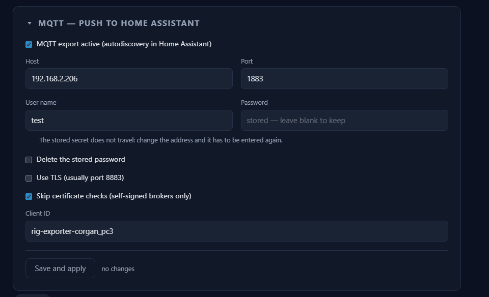
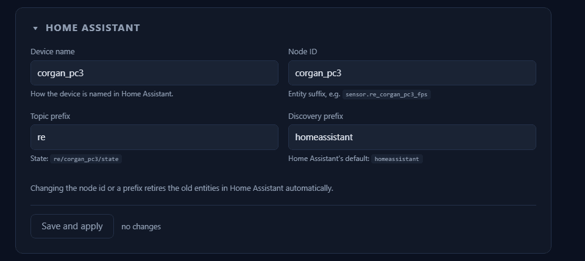
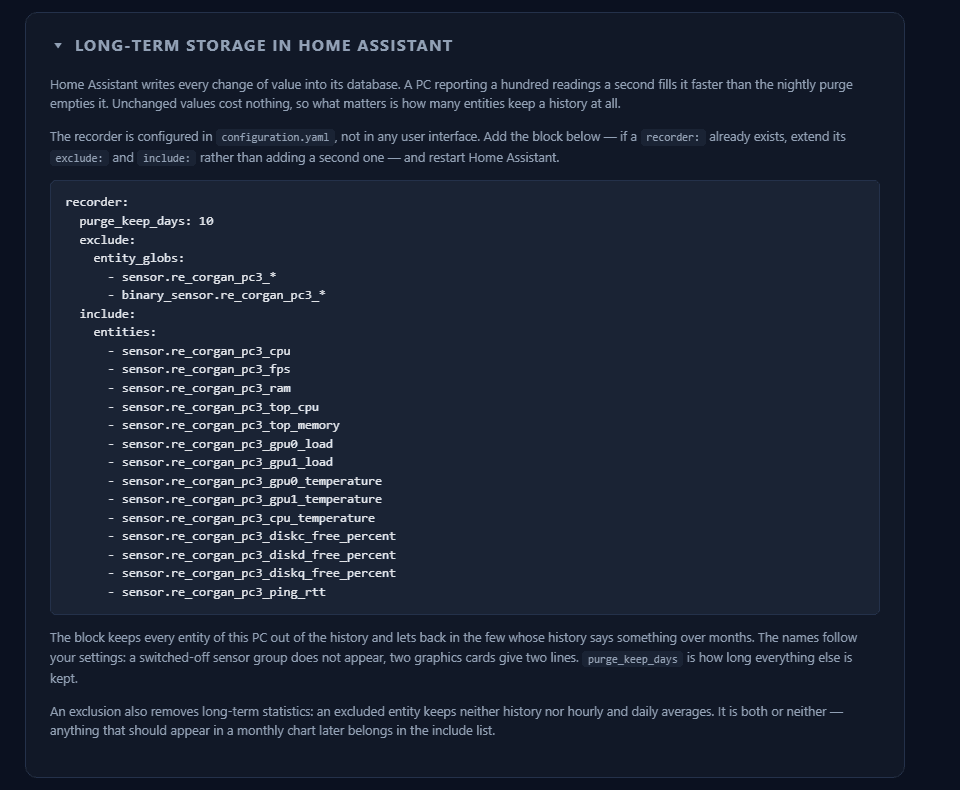
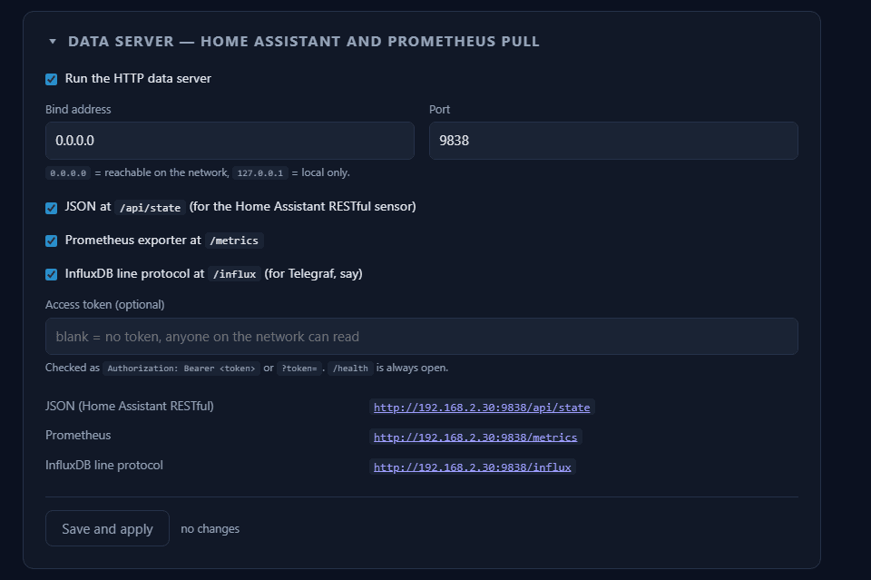
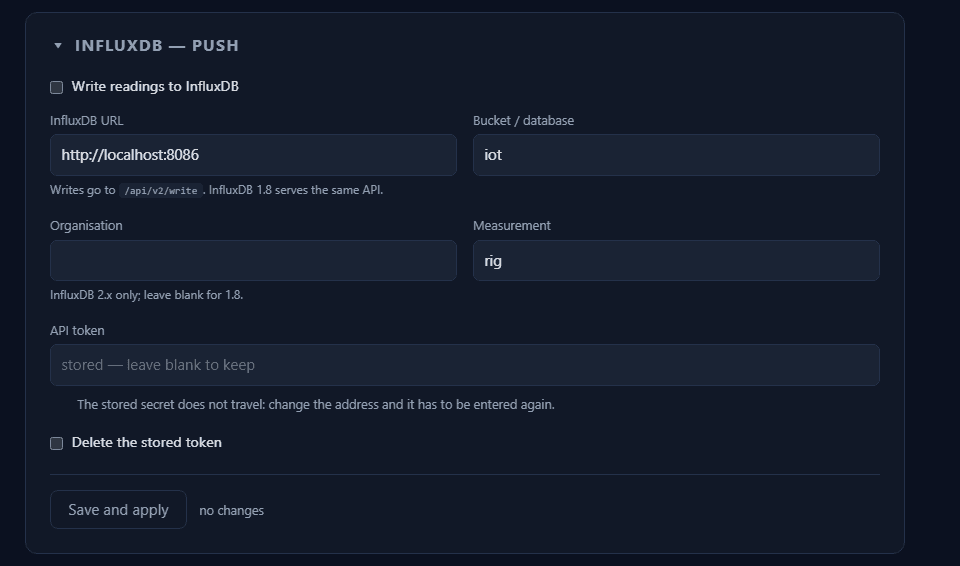
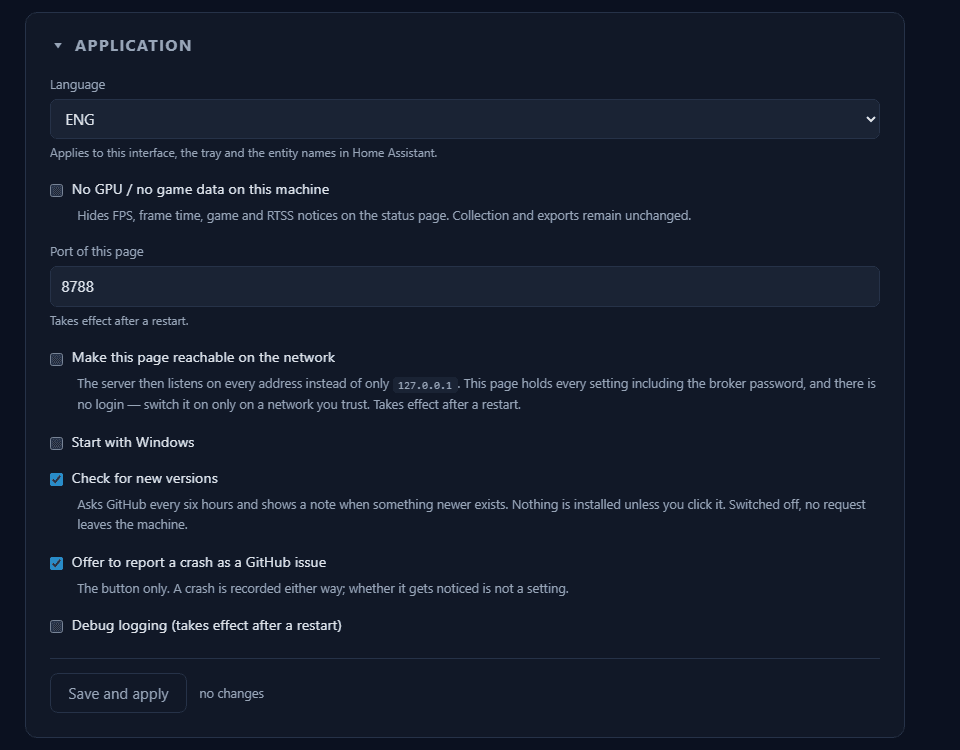

# Export & display

Where the values go, and how the program itself behaves. Seven boxes, from top
to bottom: **MQTT**, **Home Assistant**, **Long-term storage**, **Data server**,
**InfluxDB**, **Application** and, right at the bottom, **Logs**. Five of them
have a save button of their own, and each of those saves only its own box — see
[What applies to every page](common.md).

The fields are here. What actually goes out and how a receiver reads it is under
[Export targets](../export-targets.md).

## What applies to every box

**The connection state** sits under the active push targets, that is under MQTT
and InfluxDB: yellow while connecting, green in operation, red on an error with
the last message word for word and a button that opens the log. As long as it
runs, the line names the target — the broker address for MQTT, URL and bucket
for InfluxDB — and behind it the count of what has been sent so far. It updates
every three seconds without the page being reloaded. Push is the path that
writes outwards on its own and can therefore fail without a pull making the
error visible; going looking for the log should not be an exercise of its own.

**Secrets are never displayed.** A stored password or token reads *stored —
leave blank to keep*, and where one is stored there is a checkbox below it to
delete it. If the **broker address** or the **InfluxDB URL** changes without the
password, respectively the token, coming along in the same submission, it is
dropped instead of being sent to the new address — after exactly these two
address changes it has to be entered again. The data server's access token is
not affected by this: it is checked here and sent nowhere.

**Two boxes have no save button.** Long-term storage changes nothing in this
program, it does the arithmetic; the logs only show.

## MQTT — push to Home Assistant

**On** by default. The path this program was built for: the device and all its
entities appear in Home Assistant by themselves.

| Field | Default | Meaning |
|---|---|---|
| Host | `homeassistant.local` | The **broker**, not Home Assistant. Usually the same machine, but not the same program |
| Port | `1883` | With TLS usually 8883 |
| User name / Password | blank | As set up in the broker. The password is never shown again |
| Use TLS | off | |
| Skip certificate checks | off | Self-signed brokers only. It switches off the check, not the encryption |
| Client ID | `rig-exporter-<node>` | Has to be unique on the broker — two connections with the same id throw each other out |

!!! warning "Discovery has to be switched on in Home Assistant"

    Without it the messages arrive and **nothing happens**: Home Assistant
    creates no entities, and no error message appears here or there. In the
    [MQTT integration](https://www.home-assistant.io/integrations/mqtt/#mqtt-discovery)
    *Discovery* is active out of the box and the prefix is `homeassistant` — so
    it fits, as long as nobody has changed it. If it was changed, the discovery
    prefix in the next section has to match it exactly.

    And Home Assistant needs the
    [MQTT integration](https://www.home-assistant.io/integrations/mqtt/)
    set up in the first place. A running broker alone is not enough.

What arrives on the broker as a result — topics, entity ids, discovery
behaviour — is under [Export targets → MQTT](../export-targets.md#mqtt).

## Home Assistant

What the device is called there, and under which identifiers the values arrive.

| Field | Default | Effect of a change |
|---|---|---|
| Device name | Machine name | Only the displayed name of the device |
| Node ID | Machine name, lower case | **Part of every entity id.** Changing it renames every entity |
| Topic prefix | `rig-exporter` | Where the states are written |
| Discovery prefix | `homeassistant` | Has to match what the MQTT integration expects |

If one of these is changed, the program clears the old entities off the broker
itself the next time it connects. Dashboards and automations that point at the
old names then have to be moved over — see
[Identifiers and grouping](../identifiers.md).

## Long-term storage in Home Assistant

The third box from the top; the jump bar above the page calls it *Storage* for
short. It changes nothing in this program — it does the arithmetic and hands
over a finished configuration block, which is why it has no save button.

**Why it exists.** Home Assistant writes every state change into its database.
At a publish interval of two seconds and a good hundred entities that is tens of
thousands of rows a day — from *one* machine. The database grows quickly for it,
restarts take longer, and building the history costs noticeable performance.
None of it is noticed straight away; it is noticed after weeks.

The box therefore prints a
[`recorder:`](https://www.home-assistant.io/integrations/recorder/) block that
names exactly the entities of this machine. Three things to do with it:

* **Keep everything** — enter nothing. Only sensible with a long publish
  interval.
* **Enter the printed block.** It excludes *all* entities of this machine by
  glob and lets ten measurements back in whose history says something over
  months: FPS, CPU and GPU load, CPU and GPU temperature, RAM usage, free space
  per drive, ping and the two top-process lists. So clock rates, fan speeds,
  throughput and the inventory values stay out. The values remain visible in
  Home Assistant, they are simply not kept.
* **Keep it for less time** — lower `purge_keep_days`.

The block follows your own settings: a switched-off sensor group does not
appear, two graphics cards give two lines.

!!! warning "An exclusion also removes the long-term statistics"

    An excluded entity keeps neither history nor hourly and daily averages. It
    is both or neither — anything that should appear in a monthly chart later
    belongs in the `include` list.

Anyone who needs the values as a chart over the long run is better served by
[Prometheus](../export-targets.md#prometheus).

## Data server — Home Assistant and Prometheus pull

**Off** by default. Not a push but a web server: the receiver fetches the values
whenever it wants.

| Field | Default | Meaning |
|---|---|---|
| Bind address | `0.0.0.0` | Reachable on the whole network. `127.0.0.1` = this machine only |
| Port | `9838` | |
| Access token | blank | Blank means: **anyone on the network may read** |

Below it three checkboxes, one per data format — JSON, Prometheus and line
protocol can be switched on and off individually. `/health` and the overview
page `/` are always there.

Which path serves what and who fetches it is under
[Export targets → HTTP data server](../export-targets.md#http-data-server).

## InfluxDB — push

**Off** by default. The counterpart to `/influx`: here the program writes on its
own instead of being fetched from. Both paths at once give duplicate data.

Writes always go to `/api/v2/write`. InfluxDB 1.8 serves the same API — only the
fields are filled in differently:

| Field | InfluxDB 2.x | InfluxDB 1.8 |
|---|---|---|
| InfluxDB URL | `http://host:8086` | the same |
| Bucket / database | Name of the **bucket** | Name of the **database** |
| Organisation | Name of the organisation | **leave blank** |
| Measurement | `rig` | `rig` |
| API token | Token with write access to the bucket | `user:password` — both in *one* field, with a colon |

Anyone who fills in the organisation on 1.8 gets an error message that looks
like a permissions problem and is not one.

What the points written along the way look like — measurements, tags and
fields — is under [Export targets → InfluxDB](../export-targets.md#influxdb).

## Application

How the program itself behaves, independently of any export target.

| Setting | Default | Note |
|---|---|---|
| Language | follows Windows | Applies to the interface, the tray and the *displayed* names in Home Assistant, not to the identifiers |
| Port of this page | `8787` | Takes effect after a restart. If the port is taken, the server falls back to a random one |
| Make this page reachable on the network | off | Opens the interface to the LAN — **with no login**. What that means is under [The interface on the network](on-the-network.md) |
| Start with Windows | off | Starts with `-background`, that is without a browser window |
| Debug logging | off | Takes effect after a restart |
| Check for new versions | on | Switched off, no request leaves the machine |
| No GPU / no game data | off | Hides FPS, frame time, game and the RTSS notice. Collection and export are unchanged |

## Logs

The last box on the page shows the running log directly in the browser, below it
the kept files including crash records — each one to view and to download, and a
button deletes the kept ones again. None of it leaves this machine.

What the lines say and how to read them is under
[Logs in the browser](../diagnostics.md#logs-in-the-browser).
