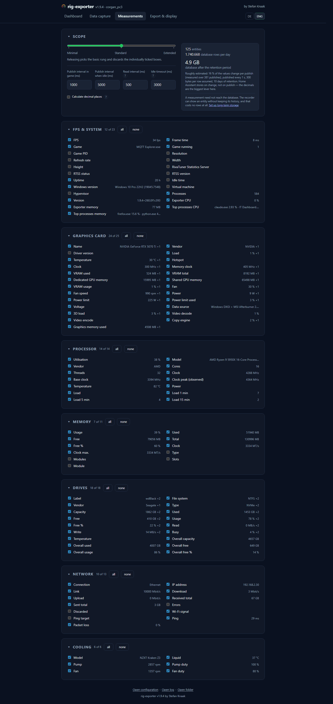
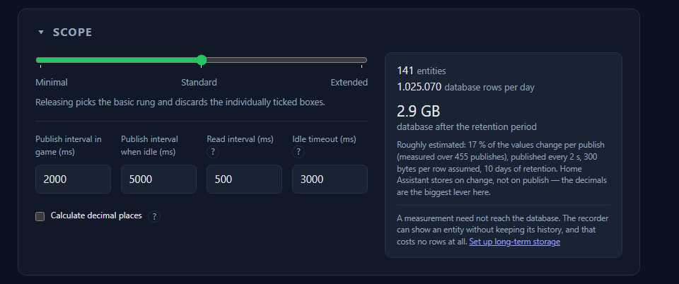

# Measurements

This is where it says which of the values read are actually sent, and how often.

**Scope** — three presets as a starting point:

| Scope | Meant for |
|---|---|
| **Minimal** | Only what a tile shows |
| **Standard** | The usual set |
| **Extended** | Everything the machine has to offer — the default |

The default is deliberately the largest set: whoever wants less can say so, but
a value that was never offered is a value nobody asks for. Below it, **every
single measurement can be unticked on its own** — the scope only sets the
starting point, it locks nothing.

The four timings:

| Setting | Default | What it means |
|---|---|---|
| **Read interval** | 500 ms | How often a reading is taken. It is what keeps the tray and the display fluid |
| **Publish interval in game** | 2000 ms | How often the export happens while something is rendering |
| **Publish interval when idle** | 10000 ms | The same when nothing is rendering — an idle machine has not got something to say every two seconds |
| **Idle timeout** | 3000 ms | When “idle” starts to apply |

So readings are taken four times as often as they are sent. That is on purpose:
the display lives off the fast rate, the broker would gain nothing from it.

**Calculate decimal places** (on) rounds values to sensible places instead of
sending them at their full floating-point width.

To the right of the scope and the intervals stands the rough estimate of the
database size; in a narrow window it drops below them. On the first visit a note
about the growing Home Assistant database appears under the box, with a
ready-made
[`recorder:` block](export-and-display.md#long-term-storage-in-home-assistant).
“Read it, do not show again” clears it for good — remembered in the
configuration, unlike the chosen view of the hardware panels.
